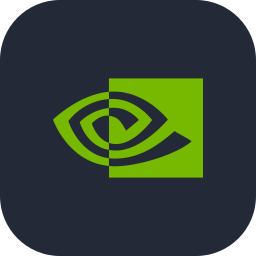
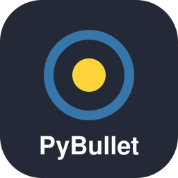

# 👋 Hi, I'm Gregorio Orlando

  

<h3 align="center">Robotics Researcher & Engineer | Robotics, AI, and Human-Robot Interaction</h3>

  Building intelligent robotic systems that combine hardware, software, and AI to interact with the physical world.

  

- 🔭 **Currently building:** [Botzo — a good boy (robot dog)](https://github.com/IERoboticsAILab/botzo)
- 🤖 **Researching:** [AIfred — a robotic desk companion](https://aifred.cyphy.life/), bringing AI assistance into the physical workspace.
- 🧠 **Research interests:** Robotics, embodied AI, human-robot interaction, computer vision, and autonomous systems.
- 🗺️ **Exploring:** SLAM, spatial mapping, Reinforcement Learning (RL), and real-time XR applications.
- 🛠️ **I enjoy:** Combining hardware and clever software to build robots that can do meaningful things in the real world.

 

<h3 align="left">🚀 Featured Projects</h3>

<table>
  <tr>
    <td width="50%" valign="top">
      <h3 align="center">🤖 AIfred</h3>
      

        
      

      

        A robotic desk companion combining a robotic arm, projector, and workspace perception to bring AI assistance into the physical workspace. This research explores how embodied AI can support learning and creative tasks.
      

      
<b>Topics:</b> Robotics · Embodied AI · HRI · Spatial Augmented Reality

    </td>
    <td width="50%" valign="top">
      <h3 align="center">🐶 Botzo</h3>
      

        
      

      

        A robot-dog project developed with the IE Robotics and AI Lab, combining physical hardware and software to build an interactive robotic platform. This project explores the integration of robotics systems through hands-on development.
      

      
<b>Topics:</b> Robotics · Hardware Integration · Software

    </td>
  </tr>
</table>

<h3 align="left">🔬 Other Research</h3>

- **From Point Clouds to Polygonal Walls:** Exploring lightweight representations of SLAM maps for real-time XR, reducing a map's mesh complexity from approximately 4.27 million triangles to 18,094 while preserving a representation suitable for immersive environments.
- **Robotics & AI:** Exploring how perception, intelligent software, and physical systems can work together to create useful robots.

<h3 align="left">🤝 Connect with me</h3>

  
  
  

<h3 align="left">🧰 Languages, Frameworks & Tools</h3>

  
  
  
  
  
  
  
  
  
  
  
  
  
  
  
  
  
  

<h3 align="left">📊 GitHub Stats</h3>

  

---

  <i>"Building robots that bring intelligence into the physical world."</i>

